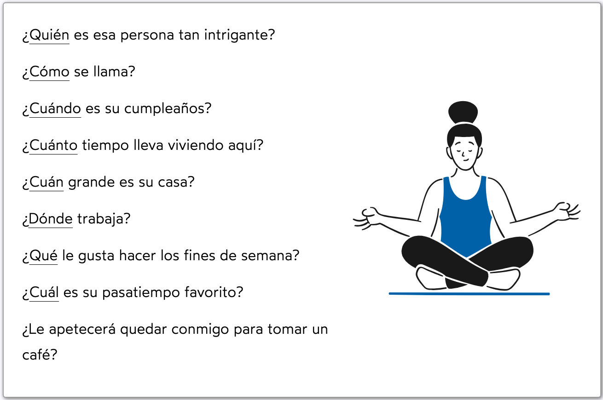

# Índice

- [Introducción](#introducción)
- [Capítulo 1](#capítulo-1)
- [Capítulo 2](#capítulo-2)
- [Bibliografía](#bibliografía)

# Introducción

> La educación es el arma más poderosa que puedes usar para cambiar el mundo.
> 
> — Nelson Mandela

Bienvenido/a a *"Lengua española: pronombres, determinantes y verbos"*. Este libro ha sido diseñado como una guía para aquellos que desean dominar los fundamentos de la gramática española, centrándose específicamente en los **pronombres, determinantes y verbos de presentación más comunes utilizados en el idioma**.

La elección del español como lengua de estudio es una decisión que conlleva la apertura a un mundo rico en cultura, historia y diversidad lingüística. En este viaje de aprendizaje, nos sumergiremos en los aspectos esenciales de la lengua española, proporcionando explicaciones claras y ejemplos para reforzar el conocimiento adquirido.

En esta obra, nos centraremos especialmente en los verbos utilizados para presentarse, ya que constituyen la base fundamental para establecer comunicación en cualquier contexto. Aprenderemos cómo conjugamos estos verbos en diferentes tiempos verbales, así como las diversas formas de pronombres y determinantes que los acompañan para construir oraciones significativas.

Los determinantes acompañan a los sustantivos y concuerdan con ellos en género (masculino o femenino) y número (singular o plural). Tienen como función introducir en la oración lo que designa el sustantivo de manera determinada, limitando su significado. Se clasifican en definidos (el, mi, este) e indefinidos o cuantificadores (poco, bastante, algún).

Los pronombres no van acompañados de un sustantivo sino que lo reemplazan. Concuerdan con el sustantivo al que reemplazan en género y número. Se clasifican en: personales, posesivos, reflexivos, relativos e interrogativos.

# Capítulo 1

## Introducción: Los determinantes y los pronombres

Los **determinantes** acompañan a los sustantivos y concuerdan con ellos en género (masculino o femenino) y número (singular o plural). Tienen como función introducir en la oración lo que designa el sustantivo de manera determinada, limitando su significado. Se clasifican en **definidos** (el, mi, este) e **indefinidos** o **cuantificadores** (poco, bastante, algún).

Los **pronombres** no van acompañados de un sustantivo, sino que lo reemplazan. Concuerdan con el sustantivo al que reemplazan en género y número. Se clasifican en: **personales**, **posesivos**, **reflexivo**, **relativos** e **interrogativos**.

## Pronombres personales. ¿Qué es un pronombre personal?

Los pronombres personales nos dicen quiénes participan en un discurso: quiénes hablan y de qué se habla. Se organizan en torno a tres personas: la primera, segunda y tercera personas del singular y las mismas del plural. Solo algunos pronombres personales en español tienen género.

A continuación, te presentamos una explicación sobre cuáles son los pronombres en español y en que grupos se clasifican según su función en la oración.

### Uso de los pronombres personales

Los pronombres personales nos indican **quiénes son los participantes del discurso** y las **personas o cosas de las que hablan**. Se clasifican en singular o plural en torno a tres personas: la primera (el o la hablante), la segunda (el o la oyente) y la tercera (de lo que se habla o lo que no está presente en el momento del habla).

Los pronombres personales en español pueden **desempeñar** la **función de sujeto**, **complemento directo** (CD), **complemento indirecto** (CI) o **complemento preposicional**. La tercera persona del singular y todas las personas del plural tienen género: una forma para el femenino y una para el masculino.

### Los pronombres de cortesía en español

Los pronombres de cortesía son usted y ustedes en español. Se utilizan para referirse al interlocutor de manera respetuosa en singular o en plural, según sean una o varias personas. El verbo se conjuga en la tercera persona singular o plural.

Ejemplo:

* ¿Usted es el titular del contrato de luz?
* ¿Ustedes dos son los inquilinos?

### El pronombres vos

En muchos **países latinoamericanos** se utiliza el pronombre **vos en lugar de tú o usted**. Este fenómeno lingüístico se conoce como **voseo**. En función de la región, existen también diferentes maneras de conjugar el verbo.

**Ejemplo:**

* Tú cantas → vos cantás

## Uso de los pronombres personales

Existen los siguientes:

* Pronombres sujeto
* Pronombres de complemento directo (CD)
Pronombres de complemento indirecto (CI)
* Pronombres preposicionales

### Pronombres sujeto

El **pronombre personal sujeto** y el **verbo** siempre concuerdan en persona y número. Los pronombres personales pueden cumplir dos funciones:

- **Sujeto**: quien hace la acción del verbo;
- **Atributo**: predicado de un verbo copulativo (ser, estar, parecer).

**Ejemplo**:

- Yo sé que es verdad.
- Yo soy yo.

Por lo general, en español se omiten los pronombres sujeto, ya que la forma conjugada del verbo es suficiente para indicar de qué persona se trata. Los pronombres personales sí aparecen expresos en la oración en los siguientes casos:

- Para dirigir la atención del oyente a la identidad del sujeto;
  
  **Ejemplo**:
  - Él es mi compañero de piso.

- Para responder a la pregunta «¿quién?»;
  
  **Ejemplo**:
  - —¿Quién hace la cena esta noche? —Yo.

- En una comparación, después de la partícula «que»;
  
  **Ejemplo**:
  - Carlos es más ordenado que yo.

- Delante de algunas palabras como «mismo», «también», «tampoco».
  
  **Ejemplo**:
  - Yo misma haré la compra esta tarde.
  - Él también trabaja desde casa.

### Pronombres de complemento Directo (CD)

El complemento directo (CD) completa el significado de un verbo. Los verbos que admiten un complemento directo se denominan verbos transitivos. El complemento directo se refiere a un objeto o a una persona.

### ¿Cómo identificar el CD en una oración?

Repasa esta lista cuando quieras encontrar el CD en una oración:

* El CD acompaña siempre a un verbo transitivo.
  **Ejemplo:**

    * Como una manzana. → La como.

* El CD suele referirse a objetos y no va precedido de una preposición. Solo cuando un verbo transitivo se refiere a una persona o a un animal, el **CD** va precedido de la preposición **«a»**.

**Ejemplo:**

  * He invitado a mis padres a cenar. → Los he invitado a cenar.
  * No encuentro a mi gato. → No lo encuentro.

* Algunos verbos que rigen la preposición **a** con el CD son «echar de menos», «esperar», «invitar», «llamar», «querer», entre otros.

**Ejemplo:**

  * Echo mucho de menos a Marta. → La echo mucho de menos.
  * ¿Invitamos a Pablo también? → ¿Lo invitamos también?

* El CD de una oración en voz activa se convierte en el sujeto de esta en pasiva.

**Ejemplo:**

  * Me como la manzana.
    - oración activa
  * La manzana es comida por mí.
    - oración pasiva

→ En la sección dedicada a las oraciones pasivas puedes repasar su formación.

### Pronombres de complemento indirecto (CI)

El complemento indirecto (CI) designa el destinatario de la acción del verbo. El complemento indirecto casi siempre es una persona y va introducido por la preposición «a», aunque a veces puede ser también una cosa.

**Ejemplo:**

* A Carlos le han ofrecido un aumento.
  - CI: A Carlos = le

* Carlos siempre le pone mucho queso a la pasta.
  - CD: queso, CI: a la pasta

* `*`Cuando una oración incluye un pronombre de CD lo/la/les/las, y un pronombre de CI le o les, el pronombre de CI se transforma en se.

**Ejemplo:**

* Carlos se la pone.
  - Erróneo: Carlos le la pone.

→ En la sección de complementos del verbo puedes repasar el uso de los complementos directo e indirecto.

### Posición de los pronombres de CD y de CI

Los pronombres de complemento directo e indirecto en español ocupan un lugar determinado en las oraciones:

* Delante del verbo con todos los tiempos verbales.

  **Ejemplo:**

    - Lo conozco desde hace años. Lo = CD
    - A Carlos le encanta cocinar. Le = CI
    - El equipo de música se lo regalé yo. SE = CI. LO = CD

* En una oración que contiene un pronombre de CD y uno de CI, el indirecto precede siempre al directo.

  **Ejemplo:**
    — ¿Quién le ha regalado el equipo de música?
    — Se lo he regalado yo.

* En perífrasis verbales con un gerundio o un infinitivo, el pronombre puede ocupar dos posiciones: delante de todo el grupo verbal o tras el gerundio o infinitivo pegado a ellos.

  **Ejemplo:**

    - Queremos comprar una planta. → La queremos comprar. = Queremos comprarla.
  
  * En algunos casos hay que añadir una tilde a la forma verbal para mantener la acentuación original:

    - Estoy regando las plantas. → Las estoy regando. = Estoy regándolas.

* En oraciones en imperativo, el pronombre va después del verbo en imperativo afirmativo y antes del imperativo negativo.

  **Ejemplo:**
  - ¡Riega las plantas otra vez! → ¡Riégalas otra vez! (imperativo afirmativo)
  - No riegues las plantas más. → No las riegues más. (imperativo negativo)

### Pronombres preposicionales

* Los pronombres preposicionales, también llamados «pronombres personales en caso oblicuo», se usan después de una preposición.

### Rasgos de los pronombres preposicionales

* Los pronombres personales preposicionales van detrás de una preposición (a, con, hacia, para, por, sobre, sin, etc.).

Ejemplo:
  - Carlos cocina para mí todos los días.
  - Yo cocino para él algunas noches.

* Los pronombres de la 1ª y 2ª persona singular (mí, ti) llevan la proposición con incorporada: conmigo y contigo.
  
Ejemplo:
  - Me encanta comer contigo.

* Se usan tras la preposición a en el CI.

Ejemplo:
  - A mí me conoce muy bien.
  - A mí me hace la comida todos los días.

* Tras las preposiciones entre y según no se usan los pronombres preposicionales mí/ ti, sino los pronombres «yo/tú».

Ejemplo:
  - Entre tú y yo, Carlos es el mejor compañero de piso que he tenido.
  - Según tú, Carlos y yo somos pareja.

## Pronombres relativos

Son aquellos que unen dos frases, relacionando la segunda con la primera. No se acentúan y suelen ir acompañados de artículos o preposiciones. Son los siguientes:

- que
- cual/cuales
- cuanto/cuanta/cuantos/cuantas
- donde
- quien/quienes
- cuyo/cuya/cuyos/cuyas

### Ejemplos:

- La chica que nos saludó es mi amiga Ana.
- El pueblo del cual te hablé está aquí al lado.
- La maestra nos enseñó todo cuanto sabía.

## ¿Qué es un demostrativo?

Los demostrativos son este, ese y aquel (con sus variantes de femenino y en plural). Se utilizan para identificar a una persona, animal o cosa señalando la distancia que mantiene con respecto al hablante. Señalan tres grados de distancia que se indican con los adverbios: aquí, ahí y allí.

En este apartado conocerás los demostrativos del español y aprenderás a emplearlos correctamente. En la sección de ejercicios puedes practicar lo que has aprendido.

### Uso de los demostrativos

* Los demostrativos ubican en el espacio o en el tiempo al sustantivo al que se refieren.

  - Aquí: **este**, **esta**, **estos** y **estas** señalan proximidad con el hablante.
    Ejemplo:
    - Este camino parece un desvío.
  
  - Ahí: **ese**, **esa**, **esos** y **esas** señalan proximidad con el oyente.
    Ejemplo:
    - ¿Cuánto cuesta ese mapa que tiene detrás de usted?

  - Allí: **aquel**, **aquella**, **aquellos** y **aquellas** señalan lejanía con respecto al hablante y al oyente.
    Ejemplo:
    - ¿Será aquel sendero que veo entre los árboles?

* Cuando hacen referencia al tiempo, este se utiliza para el ahora o el futuro próximo, y ese y aquel para el pasado.

Ejemplo:

  - Esta mañana he comprado el mapa de la ruta en una gasolinera.
  - ¡Siempre recordaré ese día!
  - Cuando era pequeña, a menudo iba de ruta con mis padres. En aquella época disfrutábamos mucho al aire libre juntos.

### Determinantes demostrativos

* Se llaman «determinantes demostrativos» los demostrativos que aparecen junto a un sustantivo. Con este sustantivo, concuerdan en género y número.

  Ejemplo:
    - Este camino parece un desvío. Camino = masculino singular → este
    - Esta mañana compré el mapa de la ruta en una gasolinera. Mañana = femenino singular → esta

### Pronombres demostrativos

* Se llaman «pronombres demostrativos» los demostrativos que aparecen solos en la oración. Cuando el sustantivo al que se refieren ya se ha mencionado, puede suprimirse. Aunque aparezcan solos, siguen concordando con el sustantivo en género y número.

  Ejemplo:
  - Este camino parece un desvío.
  - Quizá ese de allí sea el correcto.

### Demostrativos neutros

* Los demostrativos neutros son siempre pronombres, es decir, no acompañan a un sustantivo, y existen solo en singular.

* Hacen referencia a algo que no se quiere nombrar o cuyo nombre se desconoce, o a algo mencionado previamente.

  Ejemplo:
  - Eso es muy interesante.
  - Dame eso, por favor.

## Pronombres posesivos

Indican pertenencia. Pueden expresar un único poseedor o varios:

### Ejemplos:

- Ese no es mi coche, el mío es negro.
- Llegaron todas las maletas menos las nuestras.
- Si esas son las vuestras, ¿de quién son las otras?

## Pronombres interrogativos y exclamativos

Sirven para preguntar sobre algo de lo que se está hablando o para exclamar. Van acompañados de signos interrogativos (¿?) o exclamativos (¡!) y deben acentuarse. Son los siguientes:

- Qué
- Quién/quiénes
- Cuál/cuáles
- Cuánto/cuántos
- Cómo

## Pronombres reflexivos y recíprocos

Pueden indicar que nos hacemos algo a nosotros mismos (**reflexivos**) o que hacemos algo a alguien que nos lo hace a nosotros al mismo tiempo (**recíproco**). **Pueden ir al final del verbo** o de manera **independiente**.

* Los pronombres reflexivos son: me, te, se, nos, os, se. 

* Solo existen en plural, ya que implican a varios sujetos.

### Ejemplos:

- Me visto rápido y voy a comprar.
- Se sentó en el sofá a descansar.
- Vamos a maquillarnos al baño.

## Pronombres indefinidos

Hacen una mención a algo **sin identificarlo** o bien de **manera vaga**. Tienen formas muy variadas.

## Voseo

* El voseo es el empleo del pronombre «**vos**» en sustitución del pronombre «**tú**» y «**usted**» en combinación con el verbo en la segunda persona del plural.

* En este apartado conocerás las distintas variantes de voseo que existen en Latinoamérica y aprenderás a conjugar cada tiempo verbal.

Formas del voseo
Existen, fundamentalmente, dos tipos de voseo: el latinoamericano y el español.

### Voseo latinoamericano

El pronombre vos en Latinoamérica se utiliza normalmente para la segunda persona del singular: tú, usted. Además, el verbo se conjuga de una manera característica.

En lugar de la segunda persona del plural, vosotros, se prefiere la forma ustedes, que pierde su valor formal propio en España, y se usa para referirse directamente a un colectivo de personas, ya sea de forma coloquial o con especial respeto.

Ejemplo:
  - Vos sos idéntico. Vos tenés su misma cara.
  - ¿Ustedes tienen hambre?

* Dependiendo de la región, la forma del voseo es diferente:

  * Voseo absoluto: consiste en emplear el pronombre vos junto a una forma verbal característica del voseo que tiene origen en la 2a persona del plural.
    Ejemplo: poder → vos podés

  * Voseo pronominal: consiste en usar el pronombre tú junto a la forma verbal propia del voseo, con origen en la 2a persona del plural.
Ejemplo:
poder → tú podés
  * Voseo verbal: consiste en el uso del pronombre vos a la junto a la forma verbal de la 2a persona del singular.
Ejemplo:
poder → vos puedes

### Voseo español: Vuesa merced

Este tipo de voseo se refiere a la fórmula de cortesía empleada en la Edad Media en España que permitía referirse a alguien de manera reverencial. Actualmente solo se puede encontrar en novelas históricas, películas, etc. Se forma utilizando el pronombre vos + verbo en la 2a persona del plural.

  - Ejemplo: Vos sois el rey de Castilla.

Tiene origen en el latín, siendo la segunda persona del plural. En castellano antiguo se utilizaba indistintamente con sentido de plural y como forma de respeto. Para distinguir los dos usos, se introdujo la forma vosotros, reservando vos para la forma de cortesía. Con el tiempo, se generalizó su uso y se hizo común la fórmula de cortesía Vuesa merced, el actual usted.

La forma de cortesía usted ha sufrido muchas modificaciones a lo largo de la historia. Comenzó siendo «Vuesa merced», donde vuesa significa vuestra. El uso, y el mal uso, de esta fórmula durante años derivó en numerosas contracciones que han quedado documentadas en los textos literarios: «vuessa merçed», «vuesarçed», «vuarçed», «vuaçed», «vusted», hasta llegar finalmente a la fórmula actual: «usted».

Puedes seguir consultando más información en [este enlace](https://espanol.lingolia.com/es/gramatica/pronombres-y-determinantes/voseo) sobre gramática española. 

# Capítulo 2

## Introducción: ¿Qué es un verbo?

Los verbos son palabras que expresan la acción que ejecuta el sujeto o el estado/proceso en el que se encuentra. Por ello, siempre concuerdan con el sujeto en persona y número. Los verbos son el núcleo del predicado. Además, pueden ir acompañados de complementos que añadan información sobre cómo ocurre la acción o qué elementos involucra.

### Forma personal y no personal del verbo

Los verbos tienen formas personales y formas no personales.

#### Las formas no personales del verbo

Son las formas no conjugadas: el infinitivo (cantar), el gerundio (cantando) y el participio (cantado). Estas son fijas y no concuerdan, por tanto, con el sujeto.

- Todos los verbos en infinitivo terminan en **-ar**, **-er** o **-ir**.
  - **Ejemplo:** cantar, comer, vivir

- Todos los verbos en gerundio terminan en **-ando** o **-iendo**.
  - **Ejemplo:** 
    - cantar → cantando
    - comer / vivir → comiendo / viviendo

- Todos los verbos con participio regular terminan en **-do**. El participio solo es en algunos casos variable (**-da**/**-dos**/**-das**).
  - **Ejemplo:**
    - cantar → cantado (participio regular)
    - hacer → hecho (participio irregular)
    - La ópera es interpretada por Montserrat Caballé. (participio variable en oración pasiva)
    - Nosotros ya tenemos compradas las entradas. ↔ Nosotros ya hemos comprado las entradas. (participio variable tras el verbo tener)

En los apartados **Infinitivo** encontrarás una explicación detallada sobre el empleo del infinitivo en español y los casos en los que va acompañado de preposiciones.

Los apartados **Participio** y **Gerundio** incluyen una explicación sobre la formación del participio y el gerundio regulares e irregulares en español, así como sobre su empleo en oraciones subordinadas abreviadas.

#### Las formas personales del verbo

Son las formas conjugadas en un tiempo verbal. Un verbo en forma personal concuerda en persona y número con el sujeto de la oración, razón por la que es muy común omitir los pronombres personales sujeto.

- **Ejemplo:**

  - Nosotros cantamos
    - sujeto: 1ª persona del plural; verbo: 1ª persona del plural en presente del modo indicativo
  - Yo trabajo en un banco. → Trabajo en un banco.

Algunos verbos se conjugan de forma regular y otros de forma irregular. A menudo ocurre que un verbo es regular en unos tiempos e irregular en otros.

### Verbos principales y verbos auxiliares

El verbo es el núcleo del predicado. Cuando en una oración aparecen dos o más verbos juntos que forman una unidad, es posible distinguir entre el que aporta el significado, el verbo principal, y el que aporta información sobre el tiempo de la acción, el verbo auxiliar.

#### El verbo principal

El verbo principal es el que aporta el significado y contenido de la acción. Puede aparecer solo, si el tiempo verbal es simple, o acompañado de un verbo auxiliar, si se trata de un tiempo compuesto. Si aparece solo, el verbo principal está conjugado; si aparece junto a un verbo auxiliar, el verbo principal aparece en participio.

**Ejemplo:**

- Como a la una de la tarde.
- Hoy he comido a la una de la tarde.

#### El verbo auxiliar

El verbo auxiliar sirve para formar tiempos compuestos. El verbo auxiliar aparece siempre conjugado en un tiempo verbal acompañando a un verbo principal en participio. El verbo auxiliar por excelencia con el que se forman los tiempos compuestos en español es el verbo **haber**.

Otros verbos auxiliares en español son **ser** y **estar**. El verbo **ser** junto con el verbo **haber** se utiliza en la forma pasiva de los verbos. El verbo **estar** seguido de un gerundio forma una perífrasis verbal que expresa que una acción está en curso en el momento del habla.

**Ejemplo:**

- He sido invitado a una cena.
- Estoy comiendo en un restaurante.

## Verbo ser y estar

### Ser

El verbo **ser** se emplea en español en las siguientes situaciones:

- **Apariencia física o rasgos de la personalidad**
  
  Ejemplo:
    - Félix y Raúl son altos.
    - Antón es muy simpático.

- **Identidad o rasgos identificativos**
  
  Ejemplo:
    - Yo soy Santiago.
    - Este es el Teatro Real.
    - La familia de Carlos es católica.

- **El origen**
  
  Ejemplo:
    - Marta es de México.
    - Esa lámina es de Japón.

- **Relaciones familiares o personales**
  
  Ejemplo:
    - Tatiana y Sarai son mis hermanas.
    - Estos son mis amigos.
    - Elisa es mi exnovia.

- **Posesión**
  
  Ejemplo:
    - Ese paraguas es mío.

- Cuándo o dónde tiene lugar un **evento**
  
  Ejemplo:
    - El partido de fútbol es en Valencia.
    - El partido es el miércoles.

- **La fecha, las estaciones y la hora**
  
  Ejemplo:
    - Hoy es domingo.
    - Hoy es 1 de junio.
    - Es primavera.
    - ¿Qué hora es? Son las diez.

- **El momento del día**
  
  Ejemplo:
    - En España ahora es por la tarde.
    - En el norte ya es de noche.

- **Oraciones pasivas: ser + participio**

  Ejemplo:
    - Las camas son hechas con madera.

- **Con la preposición «para»: destinatario, objetivo o finalidad**
  
  Ejemplo:
    - Esa máquina es para Gabriel.
    - Esa máquina es para hacer zumos.

- **El precio**
  
  Ejemplo:
    - ¿Cuánto es?
    - Son 120 euros.

- El **material**, el **origen** o la **pertenencia** de un objeto + preposición **«de»**

  Ejemplo:
    - Ese anillo es de plata.
    - Ese anillo es de Perú.

- **La profesión**
  
  Ejemplo:
    - Juana es ingeniera.
    - Ramón es periodista.

### Estar

El verbo **estar** se emplea en español en las siguientes situaciones:

- **Estados de ánimo, mentales o de salud**
  
  Ejemplo:
    - Está triste por el examen.
    - Estoy enfermo desde ayer.

- **Aspecto**
  
  Ejemplo:
    - Mi abuela está muy joven para su edad.
    - Alfredo está muy moreno.

- **Estado civil**
  
  Ejemplo:
    - Estoy soltero.
    - Estoy prometido.
    - Estoy casado.
    - Estoy divorciado.

- **Ubicación**
  
  Ejemplo:
    - El estadio está en Valencia.
    - Los jugadores están en el hotel.

- La **fecha** o la **estación del año**: 1ª persona del plural + preposiciones **«a/en»**
  
  Ejemplo:
    - Estamos a domingo.
    - Estamos a 1 de abril.
    - Estamos en primavera.
    - ¿A qué día estamos hoy?

- **Adverbios modales**
  
  Ejemplo:
    - Está bien irse de vacaciones una vez al año.

- **Estados: preposición «de» + sustantivo**
  
  Ejemplo:
    - Marco siempre está de buen humor.
    - Marisa está ahora de camarera en Ibiza.
    - Carla y Marina están de guardia este fin de semana.

- **El precio con la preposición «a»**
  
  Ejemplo:
    - ¿A cuánto están las manzanas?
    - Están a 2€ el kilo.

- **El modo de la producción: «estar + participio»**
  
  Ejemplo:
    - fabricado + «en/con» + material: Todo el reloj está fabricado en oro.
    - hecho + «de/con» + material: El collar está hecho de papel.
    - bañado + «en» + material: El anillo está bañado en plata.

- **Tiempo verbal: «estar + gerundio»**
  
  Ejemplo:
    - Estamos cenando en el jardín.

## Los verbos haber y tener en español

### Introducción

Los verbos «haber» y «tener» corresponden a un solo verbo en la mayoría de los idiomas. En español, sin embargo, han evolucionado hasta convertirse en dos verbos independientes y tienen significados diferentes, por lo que es importante saber diferenciarlos.

El verbo «**haber**» **solo** se utiliza en ciertas oraciones **impersonales** o como **auxiliar** para formar tiempos verbales compuestos. El verbo tener se emplea sobre todo con el significado de posesión.

### Conjugación

Estas tablas recogen la conjugación de los verbos haber y tener en los tiempos fundamentales del modo indicativo. Cuando el verbo haber se utiliza en oraciones impersonales, se conjuga como la tercera persona del singular en todos los tiempos excepto en presente (hay, ha habido, había, hubo, habrá).

## Haber

El verbo haber se emplea en español para lo siguiente:

- En el sentido de **existe** (forma impersonal, se conjuga como la tercera persona del singular)

  Ejemplo: Aquí hay un sitio libre.

  - A menudo acompañando a un complemento de lugar: «aquí».
  - Seguido de un complemento directo: un sitio libre.

- En la perífrasis verbal **hay + que + infinitivo** (forma impersonal), en el sentido de **ser necesario**

  Ejemplo: Hay que hacer más deporte.

  - **Sentido universal**: el contenido del enunciado se aplica a cualquier persona o situación.

- Como verbo auxiliar con un participio invariable en los tiempos compuestos: pretéritos perfecto, anterior y pluscuamperfecto, futuro compuesto y condicional compuesto del indicativo, y pretéritos perfecto y pluscuamperfecto del subjuntivo.
  
  Ejemplo:

    - Te he dicho que hagas los deberes antes.
      - Declaración neutra de que algo ya se ha dicho.
    - Hemos preparado las maletas.
      - Indica que la acción se ha producido.

## Tener

El verbo tener se emplea en español para lo siguiente:

* Con el sentido de **posesión o contenido** + complemento directo
  
  Ejemplo:

    - Tengo un coche nuevo. («Un coche nuevo» = CD)
    - El libro tiene mil páginas. («Mil páginas» = CD)

* En la perífrasis verbal **tener + que + infinitivo** (forma personal) en el sentido de **deber, estar obligado a[…]**

  Ejemplo: Tienes que ir a la cama más temprano.

    - Sentido relativo: el contenido enunciado se aplica al sujeto.

* Como verbo auxiliar, para subrayar la **reiteración** de una acción, seguido de un participio variable
  
  Ejemplo:
    - Te tengo dicho que hagas los deberes antes.
      - El orador está siempre repitiendo lo mismo.
    - Tenemos preparadas las maletas.
      - Se recalca el hecho de que las maletas ya están preparadas.

* Para decir la **edad**
  
  Ejemplo:
    - Yo tengo quince años.

# Bibliografía 

* Lingolia Español [*Los pronombres y determinantes en español*](https://espanol.lingolia.com/es/gramatica/pronombres-y-determinantes)

* Lingolia Español [*Los verbos ser y estar en español*](https://espanol.lingolia.com/es/gramatica/verbos/ser-estar)

* Global Examn [*Tipos de pronombres: uso, reglas, ejemplos y ejercicios*](https://global-exam.com/blog/es/gramatica-espanola-tipos-de-pronombres-uso-reglas-ejemplos-y-ejercicios/)
